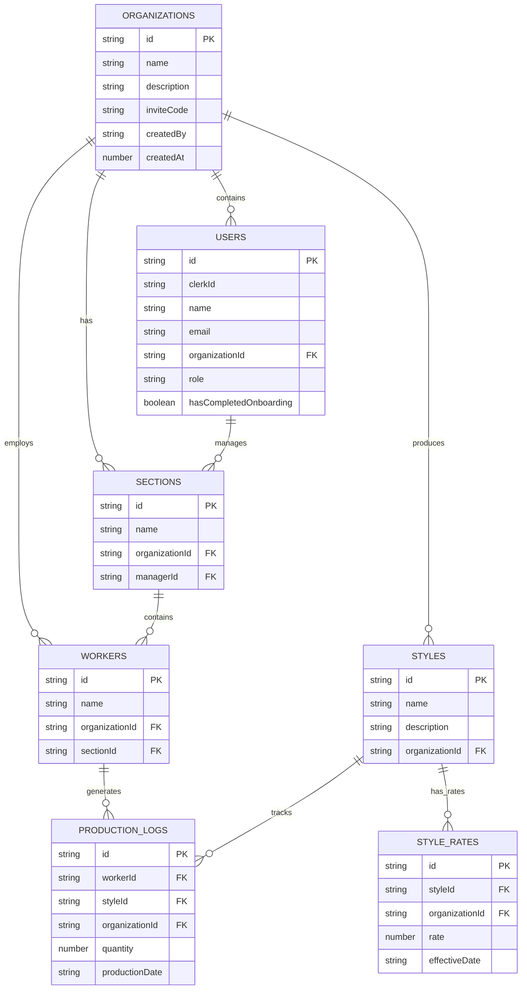

# 📊 RateSheet - Production Tracking & Payroll Management

<div align="center">


**A comprehensive production tracking and payroll management system for garment manufacturing facilities**

[](https://nextjs.org/)
[](https://reactjs.org/)
[](https://www.typescriptlang.org/)
[](https://convex.dev/)
[](https://clerk.com/)
[](https://tailwindcss.com/)

[🚀 Live Demo](#) • [📖 Documentation](#features) • [🐛 Report Bug](https://github.com/yourusername/ratesheet/issues) • [✨ Request Feature](https://github.com/yourusername/ratesheet/issues)

</div>

---

## 🌟 Overview

RateSheet revolutionizes production tracking in garment manufacturing by replacing manual processes with a digital, real-time system. Built for accuracy and efficiency, it enables transparent payroll calculations based on dynamic piece-rate models where payment rates can vary over time.

### 🎯 Key Problems Solved
- **Manual Tracking Errors**: Eliminates paper-based production logging
- **Payroll Complexity**: Automates calculations with time-sensitive rates
- **Data Fragmentation**: Centralizes all production and payroll data
- **Access Control**: Role-based permissions for different user types

---

## ✨ Features

### 🏭 **Production Management**
- **Real-time Logging**: Track daily worker output by style and date
- **Multi-style Support**: Handle multiple product styles simultaneously
- **Date-based Tracking**: Comprehensive production history
- **Section Organization**: Organize workers into logical production sections

### 💰 **Dynamic Payroll System**
- **Time-sensitive Rates**: Style rates that change over time (e.g., monthly updates)
- **Automatic Calculations**: Real-time payroll computation based on production logs
- **Independent Pricing**: Each style has its own rate schedule
- **Historical Accuracy**: Payroll calculated using rates effective on production dates

### 👥 **Multi-tenant Organization System**
- **Organization Creation**: Admins can create new organizations
- **Team Invitations**: Invite managers using secure invite codes
- **Role-based Access**: Distinct permissions for admins and managers
- **Data Isolation**: Complete separation between organizations

### 🎨 **Modern User Experience**
- **Dark/Light Mode**: Full theme support with system detection
- **Mobile Responsive**: Optimized for all device sizes
- **Sticky Navigation**: Always-accessible dashboard navigation
- **Loading States**: Smooth, professional loading animations
- **Real-time Updates**: Live data synchronization across users

---

## 🏗️ Architecture

### **Database Schema**


### **Tech Stack**
- **Frontend**: Next.js 15.4.6 with App Router, React 19.1.0, TypeScript 5
- **Backend**: Convex (real-time database and serverless functions)
- **Authentication**: Clerk (user management and authentication)
- **Styling**: Tailwind CSS v4 with shadcn/ui components
- **Icons**: Lucide React
- **Fonts**: Plus Jakarta Sans (headings), IBM Plex Mono (body)
- **Package Manager**: Bun

---

## 🚀 Quick Start

### Prerequisites
- **Node.js** 18+ or **Bun** 1.0+
- **Git**
- **Clerk Account** (for authentication)
- **Convex Account** (for backend)

### 1. Clone the Repository
```bash
git clone https://github.com/yourusername/ratesheet.git
cd ratesheet
```

### 2. Install Dependencies
```bash
# Using Bun (recommended)
bun install

# Or using npm
npm install
```

### 3. Environment Setup
Create a `.env.local` file in the root directory:
```env
# Clerk Authentication
NEXT_PUBLIC_CLERK_PUBLISHABLE_KEY=your_clerk_publishable_key
CLERK_SECRET_KEY=your_clerk_secret_key

# Convex Database
CONVEX_DEPLOYMENT=your_convex_deployment_url
NEXT_PUBLIC_CONVEX_URL=your_convex_url
```

### 4. Set Up Convex
```bash
# Initialize Convex
npx convex dev

# This will:
# - Create your Convex project
# - Deploy the database schema
# - Set up real-time functions
```

### 5. Configure Clerk
1. Create a new application in [Clerk Dashboard](https://dashboard.clerk.com/)
2. Configure sign-in/sign-up options
3. Add your domain to allowed origins
4. Copy the API keys to your `.env.local`

### 6. Start Development Server
```bash
# Start Convex (in one terminal)
npx convex dev

# Start Next.js (in another terminal)
bun dev
```

Visit `http://localhost:3000` to see your application running! 🎉

---

## 📱 Usage Guide

### **Getting Started**
1. **Sign Up**: Create your account using email or social login
2. **Choose Path**: 
   - **Create Organization**: Start fresh as an admin
   - **Join Team**: Use an invite code to join existing organization

### **Admin Workflow**
1. **Setup Sections**: Create production departments (e.g., "Cutting", "Stitching")
2. **Add Workers**: Assign workers to their respective sections
3. **Define Styles**: Create product styles with descriptions
4. **Set Rates**: Configure piece-rates for each style with effective dates
5. **Invite Managers**: Share organization invite code with team members

### **Manager Workflow**
1. **Log Production**: Record daily worker output by style
2. **Monitor Progress**: View real-time production statistics
3. **Calculate Payroll**: Generate payroll reports for workers
4. **Manage Rates**: Update style rates as needed

### **Key Concepts**
- **Dynamic Pricing**: Rates can change monthly (e.g., $0.70 in August, $0.75 in September)
- **Granular Tracking**: Each log = one worker + one style + one day
- **Independent Rates**: Every style has its own pricing schedule
- **Automatic Calculation**: System finds correct rate based on production date

---

## 🛠️ Development

### **Project Structure**
```
ratesheet/
├── src/
│   ├── app/                    # Next.js App Router pages
│   │   ├── dashboard/          # Dashboard pages
│   │   ├── globals.css         # Global styles
│   │   ├── layout.tsx          # Root layout
│   │   └── page.tsx            # Home page
│   ├── components/             # React components
│   │   ├── ui/                 # shadcn/ui components
│   │   ├── Navbar.tsx          # Navigation component
│   │   ├── Footer.tsx          # Footer component
│   │   └── ...
│   └── lib/                    # Utility functions
├── convex/                     # Convex backend functions
│   ├── schema.ts               # Database schema
│   ├── users.ts                # User management
│   ├── organizations.ts        # Organization functions
│   └── ...
├── public/                     # Static assets
└── ...config files
```

### **Available Scripts**
```bash
# Development
bun dev                 # Start development server
npx convex dev         # Start Convex backend

# Building
bun run build          # Build for production
bun start              # Start production server

# Code Quality
bun run lint           # Run ESLint
bun run type-check     # Run TypeScript checks
```

### **Adding New Features**
1. **Database Changes**: Update `convex/schema.ts`
2. **Backend Logic**: Add functions in `convex/`
3. **Frontend Components**: Create in `src/components/`
4. **Pages**: Add to `src/app/`
5. **Styling**: Use Tailwind classes and shadcn/ui components

---

## 🎨 Design System

### **Typography**
- **Headings**: Plus Jakarta Sans (`font-sans`)
- **Body Text**: IBM Plex Mono (`font-mono`)
- **Hierarchy**: Clear visual hierarchy with proper font weights

### **Colors**
- **Primary**: Blue-based palette with purple accents
- **Semantic**: Success (green), warning (yellow), error (red)
- **Neutral**: Comprehensive grayscale for text and backgrounds

### **Components**
- **shadcn/ui**: Modern, accessible component library
- **Consistent Spacing**: Standardized padding and margins
- **Responsive Design**: Mobile-first approach
- **Dark Mode**: Full theme support

---

## 🔐 Security & Privacy

### **Authentication**
- **Clerk Integration**: Enterprise-grade authentication
- **Multi-factor Auth**: Optional 2FA support
- **Session Management**: Secure session handling
- **Social Logins**: Google, GitHub, and more

### **Data Protection**
- **Organization Isolation**: Complete data separation between organizations
- **Role-based Access**: Granular permissions system
- **Real-time Security**: Convex handles authorization automatically
- **HTTPS Only**: All communications encrypted

### **Privacy**
- **Minimal Data Collection**: Only necessary business data
- **User Control**: Users control their organization data
- **No Tracking**: No unnecessary analytics or tracking

---

## 🚀 Deployment

### **Vercel (Recommended)**
1. **Connect Repository**: Link your GitHub repository to Vercel
2. **Environment Variables**: Add your `.env.local` variables to Vercel
3. **Deploy**: Automatic deployments on every push to main

### **Other Platforms**
- **Netlify**: Full support with build commands
- **Railway**: Easy deployment with automatic HTTPS
- **Self-hosted**: Docker support available

### **Production Checklist**
- [ ] Environment variables configured
- [ ] Convex production deployment
- [ ] Clerk production instance
- [ ] Domain configured
- [ ] SSL certificate active
- [ ] Error monitoring setup

---

## 🤝 Contributing

We welcome contributions! Please see our [Contributing Guide](CONTRIBUTING.md) for details.

### **Development Process**
1. **Fork** the repository
2. **Create** a feature branch (`git checkout -b feature/amazing-feature`)
3. **Commit** your changes (`git commit -m 'Add amazing feature'`)
4. **Push** to the branch (`git push origin feature/amazing-feature`)
5. **Open** a Pull Request

### **Code Standards**
- **TypeScript**: Strict mode enabled
- **ESLint**: Follow the configured rules
- **Prettier**: Code formatting
- **Conventional Commits**: Use conventional commit messages

---

## 📄 License

This project is licensed under the MIT License - see the [LICENSE](LICENSE) file for details.

---

## 🙏 Acknowledgments

- **Next.js Team** - For the amazing React framework
- **Convex** - For the real-time backend platform
- **Clerk** - For authentication made simple
- **shadcn** - For the beautiful UI components
- **Tailwind CSS** - For the utility-first CSS framework

---

## 📞 Support

- **Documentation**: [Project Wiki](https://github.com/yourusername/ratesheet/wiki)
- **Issues**: [GitHub Issues](https://github.com/yourusername/ratesheet/issues)
- **Discussions**: [GitHub Discussions](https://github.com/yourusername/ratesheet/discussions)
- **Email**: support@ratesheet.com

---

<div align="center">

**Built with ❤️ for the garment manufacturing industry**

[⭐ Star this project](https://github.com/yourusername/ratesheet) if you find it helpful!

</div>