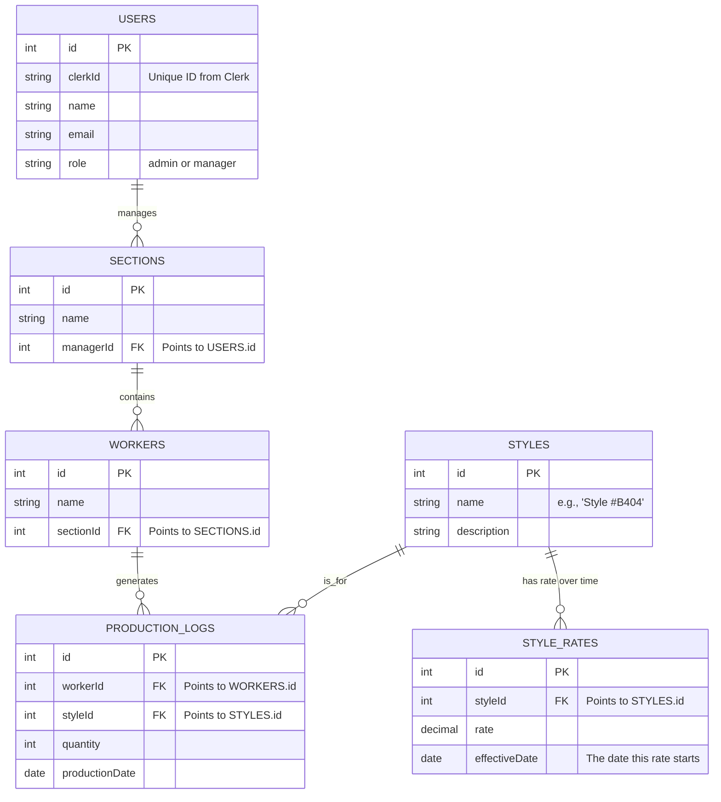

### **Knowledge Sheet & System Blueprint: Garment Production & Payroll Tracker**

#### **1. Project Overview**

This document describes a full-stack web application designed to track the daily production output of workers in a garment or manufacturing facility. The primary goal is to replace manual tracking with a digital, real-time system that enables the accurate and transparent calculation of worker payroll. The system is built around a dynamic piece-rate model where payment rates for each product style can vary over time (e.g., monthly).

#### **2. Core Objectives**

- **Digitize Production Tracking:** Allow managers to log daily production data for each worker.
- **Accurate Piece-Rate Payroll:** Automate salary calculations based on the quantity of items produced and the specific, time-sensitive rate for _each individual style_.
- **Role-Based Access Control:** Provide distinct permissions for Admins (system-wide control) and Managers (control over their assigned sections).
- **Centralized Data Management:** Create a single source of truth for all business data.

#### **3. Key Entities & Concepts**

- **User:** An Admin or Manager who logs into the system.
- **Section:** A logical grouping of workers (e.g., "Stitching Line A").
- **Worker:** An employee whose output is tracked.
- **Style:** The definition of a specific product (e.g., "Style #A113"). This is just the identifier.
- **Style Rate:** The payment rate for producing a single unit of a Style, linked to an `effective_date`.
- **Production Log:** A record of a single worker's output for a **single style** on a **single day**.

---

### **4. Database Design and Relationships**

This section details the structure of the database, which is the backbone of the application. It includes a visual diagram, explanations of the relationships, and detailed table definitions.

#### **A. Visual Entity-Relationship Diagram (ERD)**

This diagram shows how the data tables are connected to each other.

#### **B. Key Relationships Explained**

- **Users ↔ Sections:** A `Manager` (who is a type of `User`) can be assigned to manage multiple `Sections`. Each `Section` has exactly one `Manager`. This is a **one-to-many** relationship.
- **Sections ↔ Workers:** One `Section` can contain many `Workers`. Each `Worker` belongs to exactly one `Section`. This enforces organizational structure.
- **Workers ↔ Production Logs:** One `Worker` can generate many `Production Logs` over time. Each `Production Log` is created by exactly one `Worker`. This forms the basis of performance tracking.
- **Styles ↔ Production Logs:** One `Style` can be recorded in many `Production Logs`. Each `Production Log` refers to exactly one `Style`. This ensures we always know which item was produced.
- **Styles ↔ Style Rates (CRUCIAL RELATIONSHIP):** This is the core of the dynamic payroll system. One `Style` can have many `Style Rates` associated with it over time. Each `Style Rate` belongs to exactly one `Style`. This allows the price for producing "Style #A113" to be $0.70 in August and $0.75 in September.

#### **C. Detailed Table Definitions**

| Table: `users` | Purpose: Stores Admin and Manager accounts linked to Clerk authentication. |
| :------------- | :------------------------------------------------------------------------- |
| **Column**     | **Type & Description**                                                     |
| `id`           | Integer, **Primary Key**                                                   |
| `clerkId`      | String, Unique ID from Clerk. This links the DB user to the auth user.     |
| `name`         | String, User's full name.                                                  |
| `email`        | String, User's email address.                                              |
| `role`         | String, Enumeration: "admin" or "manager".                                 |

| Table: `sections` | Purpose: Defines the different production departments. |
| :---------------- | :----------------------------------------------------- |
| **Column**        | **Type & Description**                                 |
| `id`              | Integer, **Primary Key**                               |
| `name`            | String, The name of the section (e.g., "Cutting").     |
| `managerId`       | Integer, **Foreign Key** to `users.id`.                |

| Table: `workers` | Purpose: Stores information about the production workers. |
| :--------------- | :-------------------------------------------------------- |
| **Column**       | **Type & Description**                                    |
| `id`             | Integer, **Primary Key**                                  |
| `name`           | String, Worker's full name.                               |
| `sectionId`      | Integer, **Foreign Key** to `sections.id`.                |

| Table: `styles` | Purpose: The master list of all manufacturable products.         |
| :-------------- | :--------------------------------------------------------------- |
| **Column**      | **Type & Description**                                           |
| `id`            | Integer, **Primary Key**                                         |
| `name`          | String, The unique name or code for the style (e.g., "sty3030"). |
| `description`   | String, Optional longer description of the style.                |

| Table: `style_rates` | Purpose: Stores the time-sensitive payment rates for each style. |
| :------------------- | :--------------------------------------------------------------- |
| **Column**           | **Type & Description**                                           |
| `id`                 | Integer, **Primary Key**                                         |
| `styleId`            | Integer, **Foreign Key** to `styles.id`.                         |
| `rate`               | Number (Decimal), The payment amount per unit.                   |
| `effectiveDate`      | String (Format "YYYY-MM-DD"), The date this rate becomes active. |

| Table: `production_logs` | Purpose: The transactional log of daily work.                  |
| :----------------------- | :------------------------------------------------------------- |
| **Column**               | **Type & Description**                                         |
| `id`                     | Integer, **Primary Key**                                       |
| `workerId`               | Integer, **Foreign Key** to `workers.id`.                      |
| `styleId`                | Integer, **Foreign Key** to `styles.id`.                       |
| `quantity`               | Integer, Number of items produced.                             |
| `productionDate`         | String (Format "YYYY-MM-DD"), The date the work was performed. |

---

#### **3. Key Entities & Concepts**

- **User:** An Admin or Manager who logs into the system.
- **Section:** A logical grouping of workers (e.g., "Stitching Line A").
- **Worker:** An employee whose output is tracked.
- **Style:** The definition of a specific product (e.g., "Style #A113"). This is just the identifier.
- **Style Rate:** The payment rate for producing a single unit of a Style, linked to an `effective_date`.
- **Production Log:** A record of a single worker's output for a **single style** on a **single day**.

#### **4. Core Principles & Business Logic**

This is the fundamental logic of the system:

1.  **Independence of Style Rates:** Every Style has its own set of rates. The rate for "Style #A113" is completely independent of the rate for "Style #B404".
2.  **Independence of Production Logs:** Every log entry is a discrete record. A worker's output for multiple styles on the same day is recorded as multiple, separate log entries.
3.  **The Link:** The system connects these concepts during payroll calculation. It takes the `quantity` from a `production_log`, finds the correct `rate` for that log's specific `styleId` and `productionDate` from the `style_rates` table, and then multiplies them.

#### **5. User Roles & Permissions**

_(This section remains the same as the previous version)_

| Feature                 | Admin Role                                            | Manager Role                                                 |
| :---------------------- | :---------------------------------------------------- | :----------------------------------------------------------- |
| **User Management**     | `CRUD` on all users                                   | `Read-only` on their own profile.                            |
| **Section Management**  | `CRUD` on all Sections.                               | `Read-only` on their assigned section(s).                    |
| **Worker Management**   | `CRUD` on workers in **any** section.                 | `CRUD` on workers in **their assigned section(s) only**.     |
| **Style Definitions**   | `CRUD` on all Style definitions.                      | `Read-only` on all Style definitions.                        |
| **Style Rates**         | `CRUD` on Style Rates for **any** style.              | `CRUD` on Style Rates for **any** style.                     |
| **Production Logs**     | `Read-only` access to all production logs.            | `CRUD` on production logs for workers in their section.      |
| **Payroll & Reporting** | Can generate reports for the **entire organization**. | Can generate reports for **their assigned section(s) only**. |

#### **6. Core Workflows (with Explicit Examples)**

**A. Monthly Rate Setting**

A manager sets rates for September 2025. They create two separate entries in the `style_rates` table:

| styleId                   | rate | effectiveDate |
| :------------------------ | :--- | :------------ |
| (points to "Style #A113") | 0.75 | "2025-09-01"  |
| (points to "Style #B404") | 1.20 | "2025-09-01"  |

**B. Daily Production Logging**

On September 5th, Worker "John Doe" produces two different styles. The Manager creates **two separate log entries**:

| workerId               | styleId                   | quantity | productionDate |
| :--------------------- | :------------------------ | :------- | :------------- |
| (points to "John Doe") | (points to "Style #A113") | 300      | "2025-09-05"   |
| (points to "John Doe") | (points to "Style #B404") | 49       | "2025-09-05"   |

**C. Payroll Calculation (End of Period)**

The system calculates John Doe's pay for September 5th:

1.  **Fetch Logs:** It gets the two log entries shown above.
2.  **Process Log 1:**
    - `styleId` is for "Style #A113".
    - `productionDate` is "2025-09-05".
    - Looks up the rate for "Style #A113" effective on or before this date -> finds the **$0.75** rate.
    - Calculates pay for this log: `300 * 0.75 = $225.00`.
3.  **Process Log 2:**
    - `styleId` is for "Style #B404".
    - `productionDate` is "2025-09-05".
    - Looks up the rate for "Style #B404" effective on or before this date -> finds the **$1.20** rate.
    - Calculates pay for this log: `49 * 1.20 = $58.80`.
4.  **Calculate Total:**
    - Total pay for the day = `$225.00 + $58.80 = $283.80`.

#### **7. Database Schema Structure**

_(Schema definition tables remain the same, sample data is added for clarity)_

**Sample Data Example:**

**`styles` Table**
| id | name |
| :--- | :--- |
| 1 | Style #A113 |
| 2 | Style #B404 |

**`style_rates` Table**
| id | styleId (FK) | rate | effectiveDate |
| :--- | :--- | :--- | :--- |
| 101 | 1 | 0.70 | "2025-08-01" |
| 102 | 2 | 1.15 | "2025-08-01" |
| 103 | 1 | 0.75 | "2025-09-01" |
| 104 | 2 | 1.20 | "2025-09-01" |

**`production_logs` Table**
| id | workerId (FK) | styleId (FK) | quantity | productionDate |
| :--- | :--- | :--- | :--- | :--- |
| 5001 | 25 | 1 | 300 | "2025-09-05" |
| 5002 | 25 | 2 | 49 | "2025-09-05" |

#### **8. Technology Stack**

- **Frontend Framework:** Next.js
- **Backend & Database:** Convex
- **Authentication:** Clerk
- **UI Components:** shadcn/ui
- **Styling:** Tailwind CSS
- **Deployment:** Vercel
